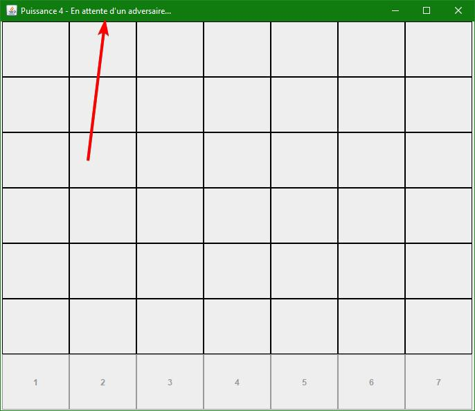
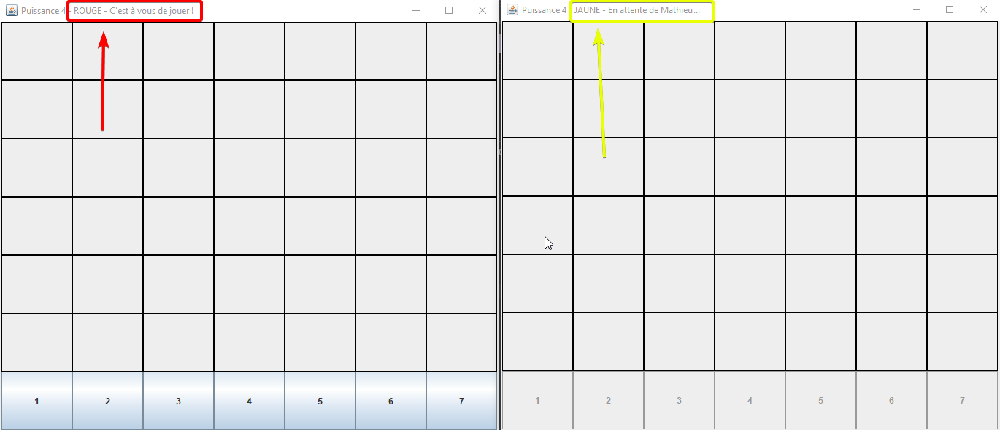

# Puissance 4 en ligne

Ce jeu de puissance 4 se joue uniquement en ligne en matchmaking rapide réalisé lors du projet développement logiciel de B2.
La recherche de joueur par pseudo est prévu à l'avenir.

## Technologies utilisés

C# pour le serveur.  
Java pour le client.

## Membres
Rémi Feydit et Mathieu Caselles.

### Roles de chacun

Rémi Feydit : A géré toute la partie Java avec d'abord la création du puissance 4 en java jouable en local en cli (avec création d'un petit serveur java local pour tester avec 1 partie à la fois). Puis création de l'interface graphique du puissance 4 s'affichant uniquement grâce aux infos que le serveur envoie en JSON via les sockets.  
Gestion des socket Java.

Mathieu Caselles : A géré toute la partie C# avec le système de matchmaking rapide puis en récupérant le puissance 4 fait par Rémi et en l'adpatant en C# afin d'avoir la logique du jeu dans le serveur et la possibilité de pouvoir avoir une infinité de jeu en simultané.
Envoie des infos du puissance 4 sous forme de JSON vers le client JAVA.
Gestion des socket C#.

## Installation

### Jouer sur un serveur personalisé

Pour héberger votre propre serveur vous aurez besoin de ngrok: https://dashboard.ngrok.com/get-started/setup.

Clonez entièrement ce projet.

Executez `ngrok.exe`. Cela va ouvrir un terminal de commande. Écrivez la ligne de commande `ngrok.exe tcp 11000`.

Cherchez une ligne ressemblant à ça (il est normal que cela ne soit pas exactement pareil) : 

`Forwarding                    tcp://0.tcp.ngrok.io:11062 -> localhost:11000 `

Ce qui nous intérresse dans cette ligne est la partie `tcp://0.tcp.ngrok.io:11062`.

Lancez ensuite le server en exécutant `Matchmaking.exe` se situant dans `Matchmaking\bin\Release\netcoreapp3.1` dans ce projet que vous avez cloné.

Exécutez ensuite le fichier `puissance4.jar`.  
Lorsque le jeu vous demande l'ip, rentrez `0.tcp.ngrok.io` que vous trouvez sur `tcp://0.tcp.ngrok.io:11062`de ngrok. Je rappel que le lien peut être différent pour vous.  
Ensuite le jeu vous demande un port. Rentrez le numéro s'affichant après les deux points du lien ngrok. Dans cet exemple c'est `11062`.  
Le jeu vous demande ensuite votre pseudo, puis lance la recherche de joueur rapide sur votre propre serveur perso !   
Une fois le pseudo choisit, la recherche d'un joueur adverse va se lancer automatiquement comme le montre la photo si dessous:  

Une fois un adversaire trouvé, le titre de l'application vous indique quand est'ce que c'est votre tour et quelle couleur vous jouez. Ce qui donne à chaque tour un de ces 2 cas:  

La partie se termine quand un joueur à aligné 4 couleurs. Un message apparait annonçant le gagnant puis le jeu se ferme.
Bien entendu pour que vos ami puissent vous rejoindre, ils doivent rentrer la même adresse et le même port que vous pour se connecter à votre serveur.  

Voila bon jeu ! 

